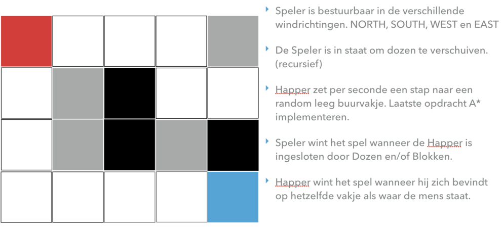

# Workshop AXON, CQRS en Event Sourcing.
Finished!!!

## Zorg ervoor dat lokaal maven, npm en node is geinstalleerd

## Voorbereiding mvn 

Als voorbereiding op de workshop hebben moeten lokaal AxonServer, MongoDB en Intellij installeren. De stappen zijn hieronder beschreven.

0. Controleer of the tools **npm**, **node** en **maven** lokaal zijn geinstalleerd. 

1. Axon server.
    * Ga naar https://axoniq.io/product-overview/axon-server en klik op de download knop.
    * Kopieer het zip bestand van je downloads map naar een geschikte lokatie. 
    * Pak het zip bestand uit.
    * Navigeer naar de map AxonServer.
    * Open een terminal en voer het commando java -jar axonserver-4.5.jar uit
    * Ga naar http://localhost:8024/ AxonDashboard zou nu zichtbaar moeten zijn
    
2. MongoDB
    * Installeer MongoDB
    * Zorg ervoor dat de MongoDB server draait.
    * De Spring applicatie gaat uit van de default configuratie. Mocht je hier van willen afwijken configureer dit dat in **application.properties** met behulp van de **spring.data.mongodb..** properties.
             
3. Installeer IntellIJ
    * Ga naar https://www.jetbrains.com/idea/, als student en docent kun je de Ultimate Edition gratis downloaden. De Community versie voldoet overigens ook.
    
4. Open het project in Intellij
    * File -> Open -> Navigeer naar de pom.xml -> Open as Project
    * Wacht tot alle dependencies, gedefinieerd in de **pom.xml**, zijn gedownload.
    * Voer het volgende commando uit in de root van het project: **mvn clean install**. Je zult ziet dat er een aantal unit tests falen. 
    Na het succesvol uitvoeren van de onderstaande opdrachten zullen de unit tests slagen.
    * Navigeer naar **HapperGameApplication.java** (src/main/java), in deze klasse staat de main methode gedefinieerd.
    * Run **HapperGameApplication.java**, Er wordt nu een Springboot applicatie gestart die te benaderen is via [http://localhost:8094/index.html] 
        
## Happer game

De Happer game is een variant op het het bekende spel Pacman. Pacman is een klassiek computerspel dat voor het eerst werd uitgebracht in 1980 als een arcadespel. 
Het spel wordt gespeeld op een twee dimensionaal rechthoekig speelveld. Dit speelveld bestaat uit N * M vakjes. Een vakje heeft minimaal 2 en maximaal 4 buren. 
Binnen het spel bevinden zich één Happer, één Mens en meerdere` dozen en blokken. De Mens is te besturen door de speler van het spel door middel van de 
pijltjes toetsen. Het is niet mogelijk om diagonaal over het bord te bewegen. Alleen de Mens is in staat om één of meerdere dozen te verplaatsen door er tegen aan te lopen. 
Blokken zijn niet verplaatsbaar en blijven dus op hun oorspronkelijke positie gedurende het spel. De Happer wordt bestuurd door de computer. Een keer per seconde de beweegt de 
Happer zich richting de Mens. Het doel van het spel is om de Happer in de  sluiten door op een slimme manier met de dozen te schuiven. 
Wanneer de Happer is ingesloten heb je het spel gewonnen. Het is uiteraard ook mogelijk om het spel te verliezen. Dit gebeurt op het moment dat Happer zich naar een vakje beweegt 
waar de mens zich bevindt.

### Domein

### Spelregels

##Opgaven - maak het spel compleet.

1. Op het moment dat de gebruiker van de webapplicatie de pijltjes toetsen gebruikt wordt er een POST request verstuurd naar games/movehuman. Dit
request wordt afgevangen door de klasse **GameRestController.java**. De RestController stuurt een Command, dit commando dat wordt afgehandeld in de **GameAggregate.java**. 
In een van de methoden die geannoteerd is met **@CommandHandler** wordt dit commando afgevangen. Deze methode bevat de game logica (==Bussiness logica) 
omtrent het bewegen van de Mens. De afhandeling van dit Commando kan resulteren in het emitten van 0 of meer Events.

    * Ga naar het AxonDashboard [localhost:8024]
        * Klik op het Commands icon
        * Worden er commands over de Commandbus verstuurd?
        * Klik op het Search icon
        * Klik op de Search oranje knop
        * Worden er events over de Eventbus verstuurd?
    
    * Draai de unit tests in de GameAggregateTest. Alle tests die beginnen met move_human_command falen.     
    * Zorg dat de mens gaat bewegen, dit doe je door het juiste **nl.rabobank.axon.happergame.coreapi.HumanMovedEvent** te versturen.  Kijk goed naar de opbouw van de dit specifieke event. (**Events.kt**)
    * Draai de unit tests in de GameAggregateTest nogmaals. Welke tests zijn nu groen en welke nog steeds rood? 
    * Probeer nu de mens te bewegen met behulp van de pijltjestoetsen. Worden er nu events over de EventBus verstuurd?
 
2. Wanneer de Happer tegen een doos aanloopt in de richting van een leeg vakje, dan moet deze doos mee bewegen. Dat is nu niet het geval. 
Het is de bedoeling dat nadat er een  **nl.rabobank.axon.happergame.coreapi.Events.HumanMovedEvent** is verstuurd er ook nog 0 of meer **nl.rabobank.axon.happergame.coreapi.Events.BoxMovedEvent** worden verstuurd.
       
3. Nu wordt het tijd voor een beetje tegenstand van de Happer. Het is bedoeling dat de Happer ook gaat bewegen. De afhandeling van de **nl.rabobank.axon.happergame.coreapi.MoveHapperCommand.java** is niet compleet.
    * Het is aan jou de taak om de afhandeling compleet te maken. Aanwijzing: je zult de methode **getHapperMovementInfo** uit de klasse **Game** moeten aanroepen en het resultaat van deze methode aanroep verwerken. 
    * Test je aanpassingen door de test *move_happer_command_should_emit_happer_moved_event_when_move_is_possible()* in **GameAggregateTest.java** te draaien. 
    * Ga naar **GameJavaSaga**. Er staan een aantal regels in commentaar. Uncomment deze regels.
    * Start het spel opnieuw. Beweegt de Happer zich nu over het veld?
    * Bekijk de inhoud van de domainevents tabel.
    * Zorg ervoor dat Happer verliest op het moment dat hij geen bewegings mogelijkheid meer heeft. Test je aanpassing door de test *move_happer_command_should_emit_game_won_event_when_moving is_not_possible()* in **GameAggregateTest.java** te draaien.
 
4. We gaan het spel iets moeilijker maken. De Mens mag maximaal 50 stappen doen. Op het moment dat hij dit aantal bereikt heeft, moet de status van het spel LOST_BY_EXCEEDING_MAX_NUMBER_OF_STEPS worden en moet het dus zowel voor de
Mens als de Happer niet meer mogelijk zijn om te bewegen. Test je aanpassingen door de test move_human_command_should_emit_game_lost_event_when_making_move_nr_50() in GameAggregateTest te draaien.

5. Het is de bedoeling dat passief gedrag wordt bestraft. Dit wil zeggen dat wanneer de Happer 5 keer heeft bewogen zonder dat de Mens een stap heeft gedaan het spel ten einde is.
De Mens heeft in dit geval het spel verloren. Je zult voor deze opgave aanpassingen moeten maken in de domein klasse **Game**. Let op: Deze klasse in de taal Kotlin geschreven, maar laat je hierdoor niet afschrikken.
Schrijf voor dit scenario ook minimaal een unit tests in de klasse **GameAggregateTest.java**   

6. Op de GUI is een Pauze knop zichtbaar. Op het moment dat de gebruiker op deze knop klikt wordt er een POST request gestuurd naar de **GameRestController**.
    * Maak nu zelf het commando nl.rabobank.axon.happergame.coreapi.PauseGameCommand aan, doe dit in **Commands.kt** (src/main/kotlin/nl/rabobank.axon.happergame/commandhandler/coreapi/Commands.kt). Het betreft hier wederom Kotlin code. Laat je hier niet door afschrikken
    * Verstuur dit Commando over de CommandBus tijdens de afhandeling van bovengenoemde POST request.
    * Vang dit Commando op de juiste manier af in **GameAggregate.java**. Let goed op welke bestaand event je moet emitten.
    * Zorg ervoor dat het mogelijke wordt om een gepauzeerd spel weer tot leven te roepen.
